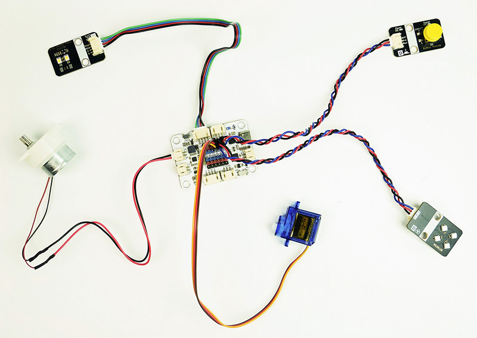
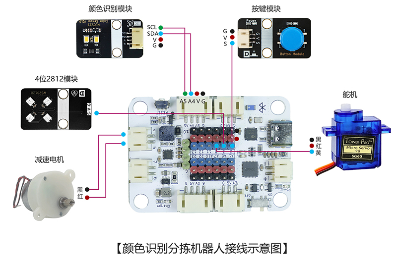
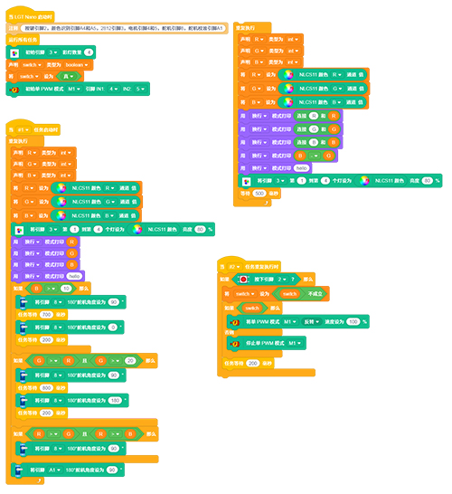

# 颜色识别分拣机器人

<u>图片</u>
## 产品概述

颜色识别分拣机器人是一款基于机器视觉技术的智能分拣设备，能够自动识别物体颜色并进行分类分拣。是一款面向青少年科创启蒙的**入门级智能分拣科创套件**，集机械传动、智能识别、自动控制、灯光交互于一体，兼顾动手实践、编程学习与科学探究多重价值。成品可作为科技展示摆件、课堂实验教具，趣味性与专业性兼备，是中小学科创教学、课后实践、亲子DIY的优质科创器材。

 

## 产品参数

| 参数 | 规格 |
|:----:|------|
| 型号 | zmf-0001 |
|   制作类型   | 手工拼装、采用螺丝紧固结构                                   |
| 支持识别颜色 | 红、黄、蓝、绿、黑、白等（程序默认设定识别红、蓝、绿三种颜色） |
| 供电方式 | TYPE-CUSB端口，供电电压5V |
| 产品尺寸 | 282x136x189mm |
| 核心主板 | LGT Nano主板 |
| 硬件模组 | 90g舵机、NLCS11颜色识别模块、按键模块、4位WS2812B七彩灯模块、JS30驱动电机 |
| 支持编程软件 | Blockcode（图形化编程+无线下载）、Mixly、Arduino |
| 结构材质 | 厚度2.5mm进口奥松板 |

 

## 功能特性

- 实时颜色识别、识别颜色直观展示

- 自动分拣分类

- 支持多种颜色识别

- 支持自定义分拣规则

- 数据统计与分析

- 支持无线下载：直接通过蓝牙下载程序，方便调试和更换代码

   

## 工作原理

通过按下实体按键启动设备，触发JS30电机带动传送带平稳运转，将放置的不同颜色色块匀速传送至识别区域；当NLCS11颜色识别模块精准感知、识别色块颜色后，即刻反馈数据至主控板，同步驱动4位WS2812B七彩灯模块点亮对应颜色灯光，直观展示识别结果；与此同时，主控板控制180度舵机精准转动，将不同颜色的色块精准转移至对应的专属置物框内，完成全自动识别、灯光反馈、分类分拣的完整流程，自动化演示效果直观清晰。

 

## 使用说明

### 材料清单

| 名称              | 数量 | 名称            | 数量 | 名称                | 数量 |
| ----------------- | ---- | --------------- | ---- | ------------------- | ---- |
| LGT maker-nano    | 1    | sg90舵机        | 1    | NLCS11 颜色识别模块 | 1    |
| 按键模块          | 1    | 4位WS2812B模块  | 1    | JS30电机            | 1    |
| 连接轴            | 1    | 传送带          | 1    | 竹签                | 1    |
| PH2.0转杜邦3pin线 | 2    | PH2.0双头4pin线 | 1    | ph2.0单头           | 1    |
| TYPEC-数据线      | 1    | 6色颜料带笔刷   | 1    | 椴木结构板          | 3    |
| 塑料铆钉4070      | 12   | 塑料铆钉3065    | 3    | 2.3*6mm自攻螺丝     | 15   |
| 1.7*6自攻螺丝     | 4    | 螺丝刀          | 1    | 热缩管              | 3    |
| 小瓶木工胶        | 1    | 3mm胶           | 2    | 扎线带              | 2    |

### 实物连接图

### 接线示意图

 

### 产品程序

[软件下载与安装](../../software/installation.md)

程序下载：

[0001-颜色识别分拣机器人-blockcode](程序/0001-颜色识别分拣机器人-blockcode.rar)
 

### 传感器模块介绍

[山屿智能文档中心](../../../_sidebar.md)

### 组装教程

组装视频教程请移步公众号