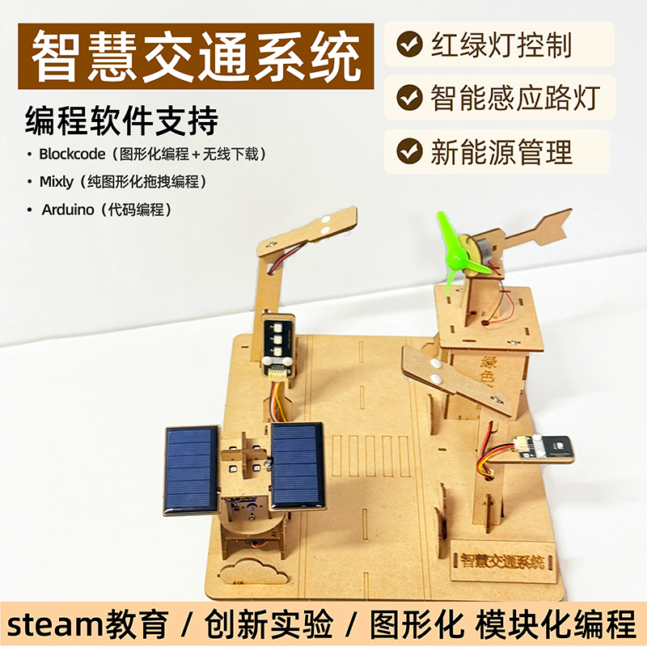
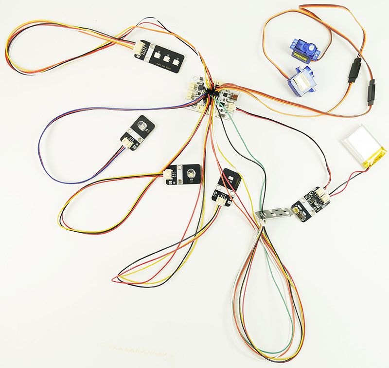
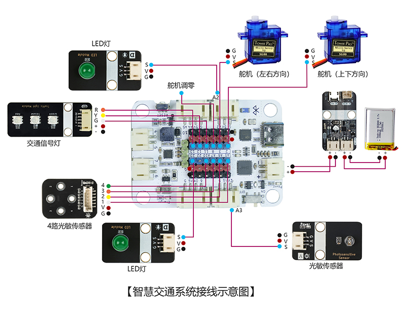
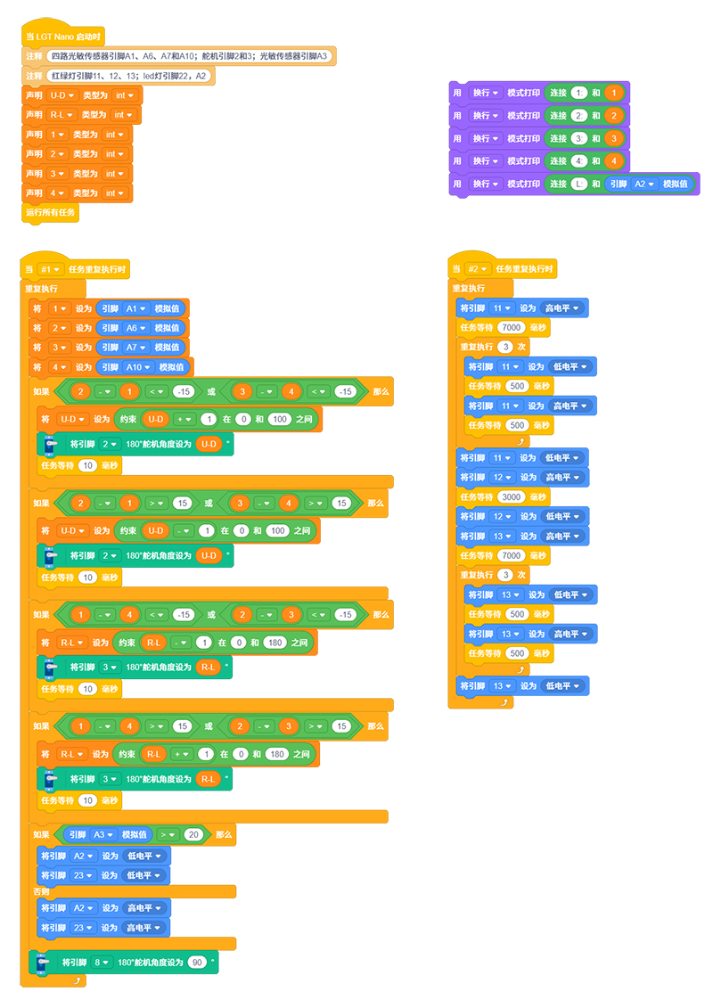

# 智慧交通系统

## 产品概述

智慧交通系统是一款专为青少年打造的科创入门级智能搭建套件，融合交通控制、路灯光感自动控制、新能源储能三大系统，兼顾动手搭建、编程学习、新能源科普与桌面展示多重价值。整套设备还原现实城市交通配套设施与清洁能源供电逻辑，孩子可自主完成组装接线、程序编写、功能调试，学习交通控制、光电传感、太阳能储能、追光发电等多领域科创知识。成品可作为教学教具、科技展示摆件，兼具科普性、实操性与观赏性，是中小学科创课堂、课外兴趣活动、亲子手工 DIY 的优质器材。

 

## 产品参数

| 参数 | 规格 |
|:----:|------|
| 型号 | zmf-0002 |
|   制作类型   | 手工拼装、采用螺丝紧固结构                           |
| 使用环境 | -20℃ ~ +60℃ |
| 供电方式 | TYPE-CUSB端口，供电电压5V |
| 产品尺寸 | 300x255x175mm |
| 核心主板 | LGT Nano主板 |
| 硬件模组 | LED 灯模块、180 度舵机、4 路光敏传感器、光敏传感器、交通信号灯模块、太阳能板、太阳能电源板、300 电机、 |
| 支持编程软件 | Blockcode（图形化编程+无线下载）、Mixly、Arduino |
| 结构材质 | 厚度2.5mm进口奥松板 |

 

## 功能特性

- **智能交通控制**：高度还原现实城市交通运行逻辑，模拟真实交通场景，实现基础交通智能管控演示。

- **路灯光感自控**：搭载光电传感模块，可根据环境光线强弱自动控制路灯启停，实现智能化光影感应控制。

- **新能源储能发电**：支持太阳能储能、追光发电功能，直观演示清洁能源转化、储能及供电原理。

- **自主科创实操**：支持自主组装接线、程序编写、功能调试，兼容青少年编程学习，可自定义设备运行逻辑。

- **多领域知识融合**：整合交通科技、光电传感、新能源储能等多学科知识，科普性极强

- **场景用途广泛**：可作为教学教具、科技展示摆件，适用于科创课堂、课外兴趣活动、亲子DIY。

- **支持无线下载**：直接通过蓝牙下载程序，方便调试和更换代码

   

## 工作原理

整套智慧交通系统分为红绿灯控制系统、智能感应路灯系统、新能源管理系统三大部分，各模块独立运行又相互供电联动，完整复刻真实城市智慧交通运行逻辑。

1. 交通信号灯控制系统

   由主控板统一控制红绿灯模块，按照预设程序循环切换红、黄、绿信号灯，高度还原路口交通信号灯工作逻辑，直观展示城市交通管控基础原理。

2. 智能感应路灯系统

   光敏传感器实时检测环境光照强度，设备自动判断昼夜环境：光线充足天亮时，路灯 LED 自动熄灭；环境变暗、光照不足时，路灯自动点亮，实现全自动光感控制，学习光电感应自动化知识。

3. 新能源管理系统

   集成智能追光太阳能与风能储能结构，搭配四路光敏传感器实时捕捉太阳光照射方向，主板驱动舵机调整太阳能板角度，跟随太阳位置自动偏转，最大化接收光能，提升光电转换效率；太阳能、风能产生的电能通过太阳能电源板统一稳压处理，储存至锂电池；储存完成的锂电池持续为整套智慧交通系统所有设备供电，实现清洁能源自给自足。

 

## 使用说明

### 材料清单

| 名称              | 数量 | 名称              | 数量 | 名称              | 数量 |
| ----------------- | ---- | ----------------- | ---- | ----------------- | ---- |
| LGT maker-nano    | 1    | sg90舵机          | 2    | 300电机           | 1    |
| 4路光敏传感器     | 1    | 光敏传感器        | 1    | 风扇叶片          | 1    |
| 交通信号灯模块    | 1    | led灯模块         | 2    | 太阳能板          | 2    |
| ph2.0聚合物锂电池 | 1    | 太阳能电源板      | 1    | ph2.0转杜邦5pin线 | 1    |
| PH2.0双头3pin线   | 2    | PH2.0转杜邦3pin线 | 1    | ph2.0转杜邦6pin线 | 1    |
| PH2.0双头2pin线   | 1    | ph2.0单头         | 1    | 舵机转接线        | 2    |
| 红黑硅胶线        | 1    | TYPEC-数据线      | 1    | 二极管            | 1    |
| 塑料铆钉4070      | 15   | 塑料铆钉4090      | 2    | 2.3*6mm自攻螺丝   | 30   |
| 1.7*6自攻螺丝     | 8    | 螺丝刀            | 1    | 热缩管            | 8    |
| 小瓶木工胶        | 1    | 3mm胶             | 2    | 扎线带            | 3    |
| 椴木结构板        | 3    |                   |      |                   |      |

 

### 实物连接图

### 接线示意图

### 产品程序

[软件下载与安装](../../software/installation.md)

程序下载：

 [0002-智慧交通系统-blockcode.rar](程序\0002-智慧交通系统-blockcode.rar) 

  

### 传感器模块介绍

[山屿智能文档中心](../../../_sidebar.md)

 

### 组装教程

组装视频教程请移步公众号