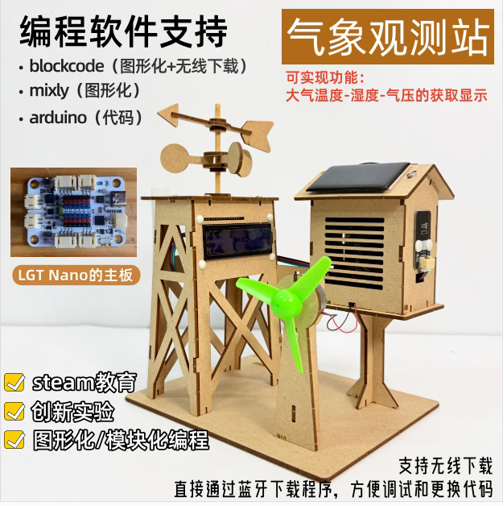
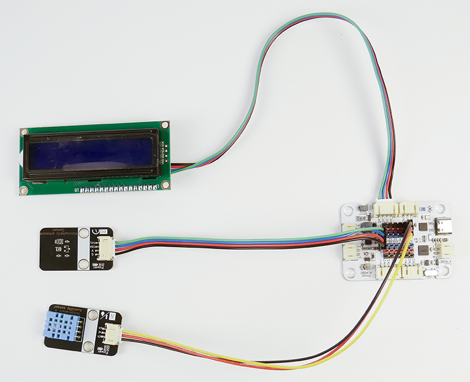
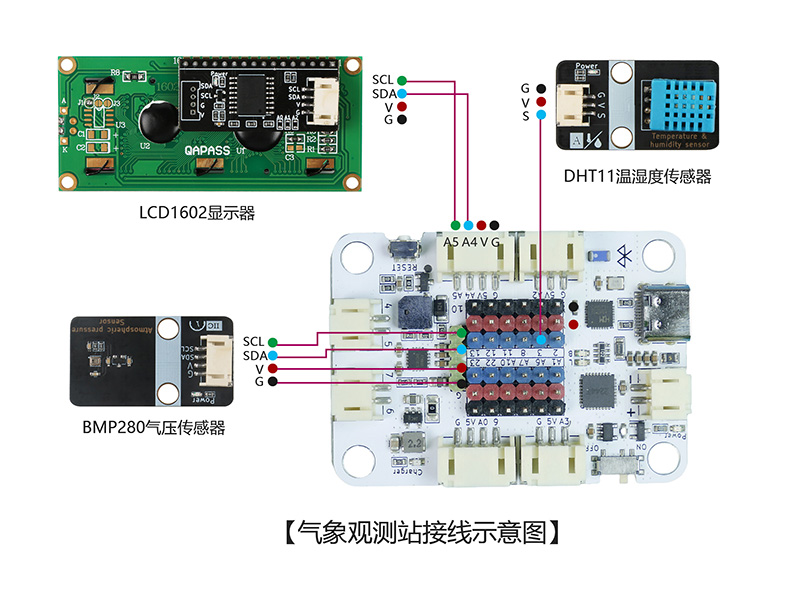
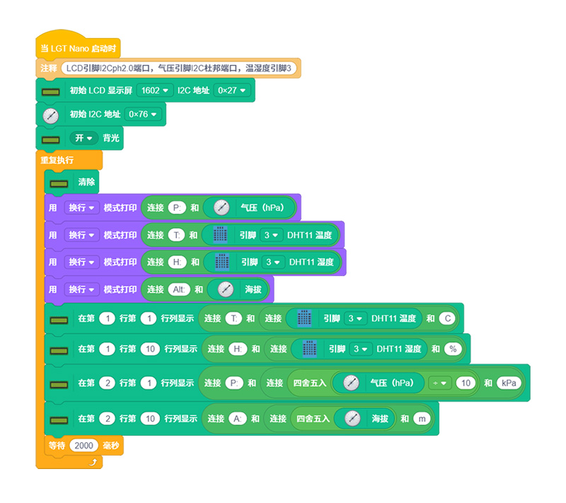

# 气象观测站

## 产品概述

气象观测站是一款由 LGT Nano 主板、温湿度传感器、气压传感器、LCD1602 液晶显示屏、太阳能板、减速电机等配件组合而成的 STEM 手工拼装套件。此套件可实现功能：实时采集温湿度、气压和海拔等环境气象数据；LCD1602 屏幕直观展示各项气象检测数值；太阳能板模拟供户外辅助供电；通过制作这个作品，让孩子了解气象站日常数据采集、数值显示、数据处理；了解太阳能光电转化原理等知识。提升科学探究兴趣。

## 产品参数

| 参数 | 规格 |
|:----:|------|
| 型号 | zmf-0015 |
|   制作类型   | 手工拼装、采用螺丝紧固结构                                   |
| 供电方式 | TYPE-CUSB端口供电，电压5V |
| 使用环境 | -20℃ ~ +60℃ |
| 产品尺寸 | 180x150x240mm |
| 核心主板 | LGT Nano主板 |
| 硬件模组 | DHT11温湿度传感器、BMP280气压传感器、LCD1602显示器、太阳能板、300电机 |
| 支持编程软件 | Blockcode（图形化编程+无线下载）、Mixly、Arduino |
| 结构材质 | 厚度2.5mm进口奥松板 |

 

## 功能特性

- ##### 多维度环境数据采集

  - DHT11 传感器：实时检测环境温度、湿度数值；
  - BMP280 传感器：采集大气气压数据和海拔高度；

- 太阳能发电展示：太阳能发电驱动电机转动

- 显示输出功能：LCD1602 液晶显示屏，可实时展示温湿度、气压、海拔等气象数据

- 支持无线下载：直接通过蓝牙下载程序，方便调试和更换代码

  

## 工作原理

通过按下实体按键启动设备，触发JS30电机带动传送带平稳运转，将放置的不同颜色色块匀速传送至识别区域；当NLCS11颜色识别模块精准感知、识别色块颜色后，即刻反馈数据至主控板，同步驱动4位WS2812B七彩灯模块点亮对应颜色灯光，直观展示识别结果；与此同时，主控板控制180度舵机精准转动，将不同颜色的色块精准转移至对应的专属置物框内，完成全自动识别、灯光反馈、分类分拣的完整流程，自动化演示效果直观清晰。

 

## 使用说明

### 材料清单

| 名称            | 数量 | 名称              | 数量 | 名称              | 数量 |
| --------------- | ---- | ----------------- | ---- | ----------------- | ---- |
| LGT maker-nano  | 1    | DHT11温湿度传感器 | 1    | 300电机           | 1    |
| LCD1602显示器   | 1    | BMP280气压传感器  | 1    | 风扇叶片          | 1    |
| 交通信号灯模块  | 1    | 太阳能板          | 2    | 10ml刻度管        | 1    |
| PH2.0双头4pin线 | 1    | PH2.0转杜邦4pin线 | 1    | ph2.0转杜邦3pin线 | 1    |
| TYPEC-数据线    | 1    | 椴木结构板        | 3    | 80mm竹签          | 1    |
| 塑料铆钉4070    | 10   | 塑料铆钉3090      | 5    | 2.3*6mm自攻螺丝   | 25   |
| 小瓶木工胶      | 1    | 螺丝刀            | 1    | 热缩管            | 3    |
| 3mm胶           | 2    |                   |      |                   |      |

### 实物连接图

### 接线示意图

### 产品程序

[软件下载与安装](../../software/installation.md)

程序下载：

[0015-小型气象观测站blockcode.rar](程序/0015-小型气象观测站-blockcode.rar) 

### 传感器模块介绍

[山屿智能文档中心](../../../_sidebar.md)

### 组装教程

组装视频教程请移步公众号