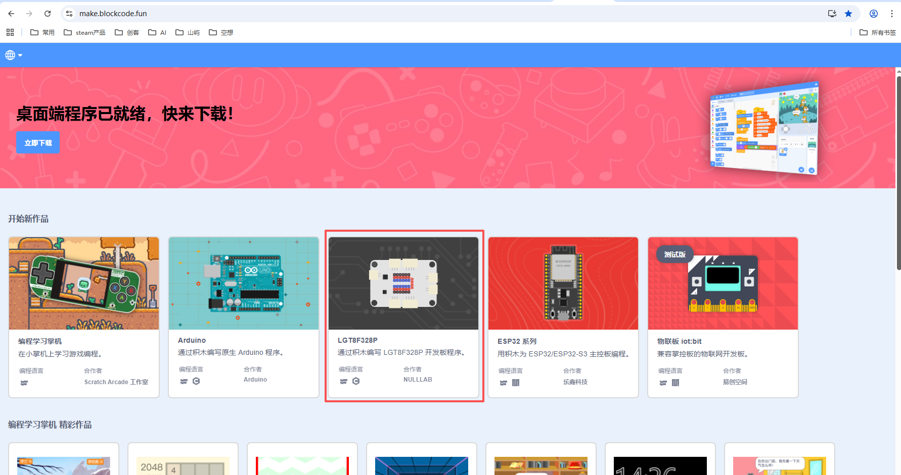
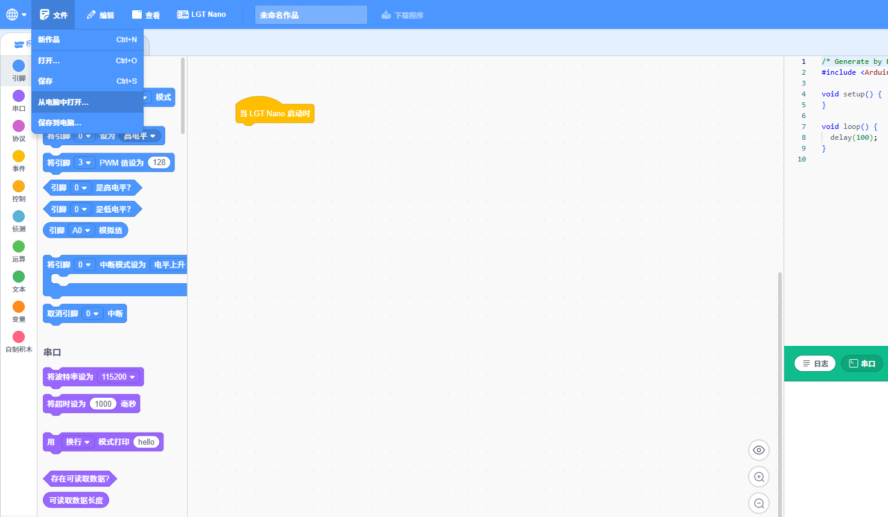

## Blockcode程序加载与上传
## 加载程序
进入软件首页
https://make.blockcode.fun/

首先选择程序的主板类型，这类以LGT8F328P主板为例。选择LGT8F328P主板，开始新作品。

单击菜单栏的“文件”，选择“从电脑中打开"

找到程序文件所在路径，选择打开已下载解压的“.bcp”后缀的程序文件

## 下载程序

将你的 LGT Nano 开发板连接到电脑 USB 接口上（如有需要，先安装好驱动，确保串口连接正常）。

1. 在“LGT Nano”设备菜单中，找到“通过 USB 连接…”选项，点击后在对话框中选中开发板，然后点击“连接”按钮。
 
    
   _(如果对话框中没有显示开发板，请检查开发板连接或重新安装驱动。)_
2. 点击菜单栏的“下载程序”按钮，程序将被编译并下载到开发板上。 
    
   _(如果下载失败，可以在“日志”窗口中查看原因：如果编译失败，则表示程序有误，请检查程序；如果断开连接，请检查开发板连接。)_

## 运行程序

程序下载完成后，设备会重启，程序将自动运行。这个程序的运行效果是开发板上的 LED 灯交替闪烁。

[ch340驱动安装](../../driver/ch340_driver/ch340_driver.md)